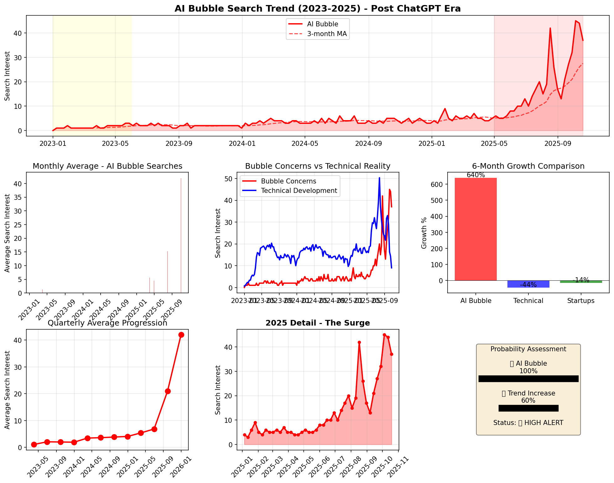

# AI Bubble or Not?

A curious developer's attempt to answer whether we're in an AI bubble, using data and multiple perspectives.

## The Question

As someone fascinated by the rapid rise of AI, I couldn't help but wonder: are we experiencing a bubble? I'm not an economist, just a developer with curiosity and some Python skills. This repository documents my journey to find an answer through data analysis and research synthesis.

After analyzing Google Trends data, reading expert opinions, and synthesizing multiple independent analyses, I found compelling evidence suggesting we're likely in an AI bubble (around 90% probability based on the indicators I examined). But I encourage you to review the data and form your own conclusions.



## What I Found

My analysis suggests several concerning patterns:

- 📈 "AI bubble" searches increased **3,600%** since GPT-4 launch
- 💭 **54%** of fund managers believe AI is in a bubble (Bank of America survey)
- 🤔 **95%** of corporate AI projects reportedly fail to deliver ROI
- 📊 OpenAI's rumored **$500B** valuation with <10% paid users raises questions
- 📉 **680%** divergence between bubble concerns and technical fundamentals

But remember: I'm approaching this as a curious outsider, not a financial expert. These are patterns I observed, not investment advice.

## Repository Structure

```
📁 phase-1-detection/     # Investigating if there's a bubble
├── analysis/             # My analysis attempts (v1 & v2)
├── data/                 # Google Trends data I worked with
└── visualizations/       # Charts I generated

📁 phase-2-strategies/    # Exploring what people might do about it
└── analysis/             # Investment strategies I found

📁 external-sources/      # Other people's research
├── phase-1/              # Their bubble detection work
└── phase-2/              # Their strategy suggestions
```

## My Approach

As a non-economist, I tried to be systematic:

1. **First Principles Thinking** - Breaking down the complex question into smaller parts
2. **Multiple Perspectives** - Synthesizing three independent analyses (including mine)
3. **Historical Patterns** - Comparing to dot-com and crypto bubbles
4. **Data + Expert Opinion** - Combining quantitative and qualitative insights

## Phase 1: Detection (What I've Done)

**My question:** Are we in an AI bubble?

**What I found:** The evidence suggests yes, with high probability. But this is based on:
- Google Trends data (2020-2025)
- Public financial metrics
- Expert quotes I could find
- Historical bubble patterns

I'm not claiming certainty - markets are complex and I'm still learning.

## Phase 2: Strategies (Expanded - Oct 20, 2025)

**Next question:** If there is a bubble, what are people suggesting to do?

### New Analysis Added:

#### 🎯 Real-Time Monitoring Dashboard (`v3/bubble_monitoring_dashboard.py`)
- Composite bubble score: **81.1/100** (Extreme Risk)
- 6 key indicators tracked with weighted scoring
- Automated recommendations based on risk level
- Visual dashboard with historical comparisons

#### 📊 Sector Rotation Analysis
- Historical patterns from 4 major corrections analyzed
- Defensive sectors typically outperform by 30-40%
- Gold/precious metals only consistent positive (+12.5% avg)
- Specific ETF recommendations by risk profile

#### 🏢 AI Company Valuations
- Tiered analysis of 20+ AI companies
- Microsoft, Google, Amazon = survivors (Tier 1)
- NVIDIA overvalued but strong moat (Tier 2)
- 90% of AI startups won't survive correction (Tier 4)
- "Quality Score" metric for evaluation

#### ⏱️ Recovery Timeline Patterns
- Typical tech bubble: 2-3 years decline, 5-10 years recovery
- AI bubble projection: Bottom in 2027, recovery by 2030
- Best opportunities during "capitulation phase"
- Historical returns post-bubble: +120% to +300% (3-5 years)

### Key Strategic Findings:
- **Barbell portfolio** most recommended (safe assets + limited tech)
- **Cash position** of 20-30% provides opportunity
- **Sector rotation** to utilities, staples, healthcare
- **International diversification** reduces correlation
- **Gold allocation** 5-10% as hedge

Again, this is research compilation, not financial advice.

## Quick Summary

| What I Measured | Value | My Interpretation |
|-----------------|-------|-------------------|
| Current Search Level | 37/100 | Seems high |
| Year-over-Year Growth | 254% | Looks extreme |
| Bubble Phase (my estimate) | Late-Middle | Based on patterns |
| Possible Resolution | 6-18 months | Just a guess |

## Data Sources

- Google Trends (Oct 2020 - Oct 2025)
- Various news articles and reports
- Bank of America Fund Manager Survey
- Public financial data

## Running My Analysis

If you want to check my work:

```bash
# Original Google Trends analysis
cd phase-1-detection/analysis/v1/
python3 ai_bubble_refined_analysis.py

# New real-time monitoring dashboard (v3)
cd phase-1-detection/analysis/v3/
python3 bubble_monitoring_dashboard.py

# Sector rotation analysis
cd phase-2-strategies/analysis/
python3 sector_rotation_analysis.py
```

## A Note on Limitations

This research has many limitations:
- I'm not a financial professional
- Markets are incredibly complex
- Past patterns don't guarantee future outcomes
- My analysis could be missing important factors

Please treat this as one curious person's exploration, not authoritative analysis.

## Contributing

I'd love to learn from others! Feel free to:
- Point out flaws in my methodology
- Add alternative perspectives
- Share better data sources
- Correct any mistakes I've made

## Why I Did This

Pure curiosity. The AI revolution is fascinating, and I wanted to understand if the excitement has gotten ahead of reality. This project taught me a lot about data analysis, market dynamics, and the importance of multiple perspectives.

## Disclaimer

This is personal research by a curious developer, not financial advice. I have no economics background. Please consult actual professionals for investment decisions.

## License

MIT - Use freely, but remember these are amateur observations!

---

*Research by a curious developer | October 2025*

*Topics explored: AI bubble, market analysis, Google Trends, technology hype cycles, investment patterns*